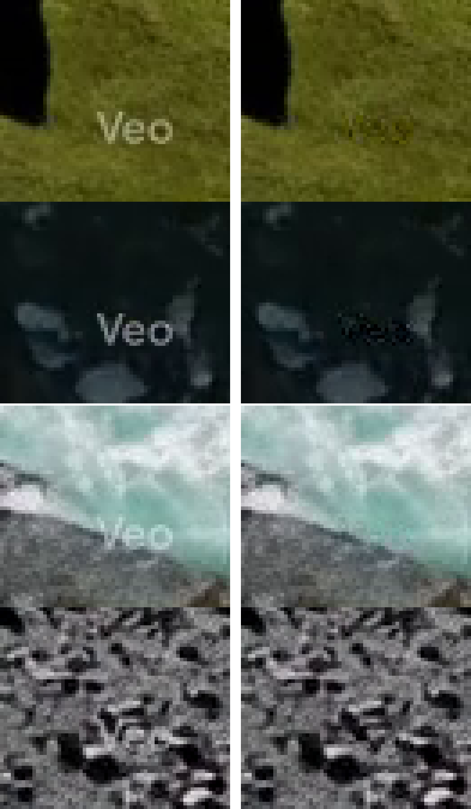

# asset-factory

Công cụ phụ trợ cho pipeline sản xuất video: **giọng đọc tiếng Việt** và
**dọn watermark Veo/Gemini khỏi video mà không làm giảm chất lượng**.

```
video_dewm.py                      xóa watermark video (reverse alpha blending)
tts_speak.py                       sinh audio tiếng Việt (edge-tts / ZeroTTS)
tools/video/extract_alpha_maps.mjs trích alpha map từ repo nguồn (MIT)
tools/video/data/                  alpha map + template đã trích (commit sẵn)
assets/audio/                      output audio
assets/video/                      output video + ảnh so sánh
```

## Yêu cầu

- Python 3.12+
- ffmpeg (bản full có `libx264`) — kiểm tra: `ffmpeg -version`
- Node.js (chỉ cần khi trích lại alpha map)
- `pip install -r requirements.txt`

---

## 1. Xóa watermark video — `video_dewm.py`

### Nguyên lý

Watermark được Google chồng lên frame bằng **alpha blending**, nên đảo lại được
bằng toán học, **không dùng AI inpainting** (inpainting sẽ vẽ lại nội dung =
mất chi tiết):

```
observed = a·LOGO + (1-a)·original
original = (observed - a·LOGO) / (1-a)
```

- Pixel **ngoài** vùng watermark giữ nguyên.
- Chỉ vùng ROI (vài chục px, góc phải-dưới) bị sửa.
- **Audio stream `copy`** → không encode lại → bit-identical.
- Video encode đúng **1 lần** (mặc định CRF 14, tuỳ chọn `--lossless` = CRF 0).
- Xử lý trực tiếp trên plane **yuv420p** (không round-trip RGB) nên PSNR ngoài
  ROI **bằng đúng** một lần re-encode thuần — không mất thêm chút nào.

### Chạy

```bash
# tối giản: tự detect, tự ước alpha, ghi assets/video/<tên>_clean.mp4
python video_dewm.py input.mp4

# chọn output + chất lượng
python video_dewm.py input.mp4 -o out.mp4 --crf 14

# pixel ngoài ROI giữ nguyên tuyệt đối (file sẽ to hơn nhiều)
python video_dewm.py input.mp4 --lossless

# chỉ xem có detect được watermark không
python video_dewm.py input.mp4 --detect-only

# đo lại sau khi encode: PSNR ngoài ROI + watermark score
python video_dewm.py input.mp4 --verify
```

### Tùy chọn

| Option | Mặc định | Ý nghĩa |
| --- | --- | --- |
| `-o, --out` | `assets/video/<tên>_clean.mp4` | file output |
| `--crf` | `14` | x264 CRF (thấp = chất lượng cao, file to) |
| `--lossless` | off | CRF 0 — pixel ngoài ROI giữ nguyên tuyệt đối |
| `--preset` | `slow` | x264 preset |
| `--rect x,y,w,h` | auto | **bắt buộc** vùng watermark nếu auto detect sai |
| `--gain` | auto | **bắt buộc** alpha gain nếu ước lượng sai |
| `--sample-frames` | `12` | số frame dùng để detect + ước lượng gain |
| `--detect-only` | off | chỉ in toạ độ watermark rồi thoát |
| `--verify` | off | đo PSNR ngoài ROI + watermark score sau encode |

### Kết quả thực tế (sample Veo 720×1280, 24 fps, 8 s)

```
detected: text  box=682,1254 23x10  score=0.978
gain    : 2.8133  (6/12 frame phẳng)
encode  : CRF 14, preset slow, audio copy
PSNR ngoài ROI : 45.19 dB avg / 44.23 min   ← bằng re-encode thuần
watermark score: 0.978 (trước) → 0.314 (sau)   (ngưỡng phát hiện 0.62)
```



### Watermark detect được

| Loại | Mô tả | Trạng thái |
| --- | --- | --- |
| **diamond** | logo hình thoi (Gemini/Veo) góc màn hình | ✅ |
| **text** | chữ `Veo` góc phải-dưới, 3 size template | ✅ |
| **SynthID** | watermark *ẩn* (không nhìn thấy) | ❌ không xóa được nếu không mất chất lượng |

### Khi kết quả chưa ưng ý

```bash
# 1. xem auto detect có đúng vùng không
python video_dewm.py input.mp4 --detect-only

# 2. nếu sai -> chỉ định tay
python video_dewm.py input.mp4 --rect 682,1254,23,10

# 3. nếu còn vệt mờ / bị overshoot -> chỉnh gain tay
python video_dewm.py input.mp4 --rect 682,1254,23,10 --gain 2.6

# 4. kiểm chứng
python video_dewm.py input.mp4 --verify
```

`--verify` đọc 24 frame, tính PSNR **ngoài** vùng watermark (đo mức độ mất
chất lượng của phần còn lại) và chạy lại detector trên output (đo mức watermark
còn sót). Score sau khi xóa phải **< 0.62**.

### Lưu ý

- Muốn `--lossless` thì không ép `--crf`.
- Nguồn thuật toán + alpha map: [`GargantuaX/gemini-watermark-remover`](https://github.com/GargantuaX/gemini-watermark-remover)
  (MIT) — xem mục so sánh bên dưới.
- Chỉ dùng trên nội dung bạn có quyền xử lý.

### So với repo tham chiếu

Repo gốc là tool **ảnh + video chạy dưới dạng web/extension**; tool này là bản
port Python tối ưu cho pipeline CLI. So sánh thực tế:

| | [`GargantuaX/gemini-watermark-remover`](https://github.com/GargantuaX/gemini-watermark-remover) | `video_dewm.py` (bản này) |
| --- | --- | --- |
| Encode video | WebCodecs **CBR 12 Mbps cố định** (`DEFAULT_VIDEO_BITRATE = 12_000_000`, `bitrateMode: 'constant'`), không có CRF/lossless | x264 **CRF** (mặc định 14) hoặc `--lossless` = CRF 0 |
| Chất lượng phần còn lại | mất chi tiết cả frame vì bitrate cố định | PSNR ngoài ROI **45.19 dB = bằng đúng re-encode thuần** |
| Audio | `copyAudioPackets` → copy được | `-c:a copy` → bit-identical |
| Chạy video | **bắt buộc Playwright + Chromium headless**, serve `dist/video-preview.html` qua HTTP local rồi lái UI web | Python + ffmpeg thuần, headless, không browser |
| Cài đặt | npm + `dist/` (clone thì phải `node build.js`) + pnpm + tải Chromium | `pip install numpy` + ffmpeg |
| Dọn residue trong ROI | có `videoCleanupBackends.js` (1.410 dòng: gradient weight map, edge denoise, bilateral, inpaint, texture repair, footprint polish) + `darkOutlineContourRepair.js` (323 dòng) + ONNX denoise `allenk-fdncnn` | **chưa port** → còn vệt mờ nhẹ nếu zoom mạnh |
| Ướ lượng alpha | seed cố định, gain kẹp trong `[0.35, 1.35]` | ước theo **frame nền phẳng**, zero-crossing từng frame rồi lấy median |
| Xử lý ảnh | có (pipeline ảnh đầy đủ) | **không** — chỉ video |
| License | MIT | port từ MIT, đã ghi nguồn |

**Cốt lõi của trade-off: chất lượng codec (bản này) ↔ chất lượng vùng
watermark (repo gốc).** Cả hai đều phải re-encode video nên không thể thắng cả
hai — muốn hết vệt mờ thì port thêm phần `videoCleanupBackends` sang đây, đổi
lại vẫn giữ được CRF/audio copy/PSNR như trên.

---

## 2. TTS tiếng Việt — `tts_speak.py`

```bash
# edge-tts (mặc định, online, miễn phí)
python tts_speak.py "Xin chào thế giới."

# đọc từ file, chỉ định output
python tts_speak.py --file script.txt -o assets/audio/narration.mp3

# đổi giọng / tốc độ / cao độ
python tts_speak.py --voice vi-VN-HoaiMyNeural --rate +10% --pitch +5Hz "..."

# ZeroTTS local (offline, lần đầu tải ~900MB weights)
python tts_speak.py --provider zero --voice maichi "Hôm nay trời đẹp quá."

# danh sách giọng
python tts_speak.py --list-voices
```

Mặc định ghi vào `assets/audio/<timestamp>.mp3`.

| Provider | Ưu điểm | Nhược điểm |
| --- | --- | --- |
| `edge` (mặc định) | nhanh, nhiều giọng, không cần cài gì thêm | cần mạng |
| `zero` | chạy offline | tải ~900MB weights, chậm hơn |

---

## 3. Trích lại alpha map (nâng cao)

`tools/video/data/*.bin` đã được commit sẵn. Chỉ cần chạy lại khi muốn cập nhật
từ repo nguồn:

```bash
git clone https://github.com/GargantuaX/gemini-watermark-remover
node tools/video/extract_alpha_maps.mjs ./gemini-watermark-remover
```

Sinh ra `alpha_<key>.bin` (map diamond theo size) và
`veotext_<id>.bin` + `templates.json` (template chữ `Veo`).
